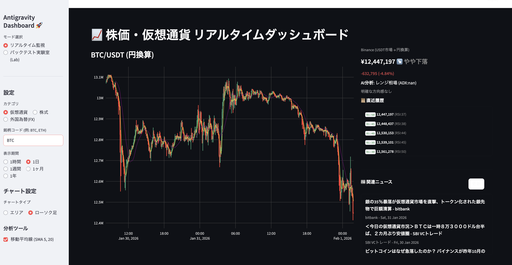

# 【検証】爆速でアプリを作るためのAI開発ツール戦略：Antigravity vs Speckit 徹底比較

最近、AIを活用した開発ツールがたくさん出ています。そして「どれを使えば一番早く、良いものが作れるか？」と迷っている方も多いのではないでしょうか。
今回、私は実際に「仮想通貨のアルゴリズムトレードアプリ」を開発しながら、主要なAI開発手法である **Antigravity**、**Speckit**、そして **Kiro** (Chat-Driven) を比較検証してみました。

個人的な意見、経験ですが、参考になればと思います。

最近、「仕様書駆動開発 (SDD)」が脚光を浴びています。でも実際にやってみて見えてきた「仕様書駆動開発 (SDD) の落とし穴」と、現時点での「最適解」についてシェアします。

---

## 1. 3つの主要プレイヤー：そもそも何が違う？

まずは、今回比較した3つの手法の違いをざっくり表にまとめてみました。

| 特徴 | Antigravity | Speckit | Cursor / Copilot |
| :--- | :--- | :--- | :--- |
| **開発スタイル** | **共創 (Co-Creation)** | **厳格 (Strict)** | **没頭 (Flow)** |
| **AIの役割** | PM 兼 ペアプログラマー | ドキュメント管理者 | 高知能オートコンプリート |
| **仕様書の扱い** | 後からついてくる | 最初に全部書く (絶対) | **基本は暗黙** |
| **重視する価値** | **納得感とUX** | **正確性と網羅性** | **開発速度と体験** |

それぞれのツールの特徴をもう少し詳しく見ていきましょう。

### ① Antigravity (共創型パートナー)
私が今回メインで使ったのがこれです。単なるコード生成ツールではなく、**「PM（プロダクトマネージャー）兼エンジニア」** として振る舞ってくれます。
実は、AWSが発表した実験的なツール **「AWS Kiro」** も、このAntigravityと同じく **"Agentic Spec-Driven Development"** を標榜しています。つまり、Antigravityのアプローチこそが、GoogleやAmazonが目指す「AI開発の未来」そのものなのです。

*   **特徴**: 私が「なんか格好いいUIで」と言うと、「ではPlotlyを使ってダークモードにしましょう」と仕様を提案し、合意してから実装してくれます。

### ② Speckit (厳格な仕様ファースト)
「仕様書こそが正義（Single Source of Truth）」という設計思想のツールです。
*   **特徴**: 完璧な仕様書（Markdown）を書かないと、1行もコードを書いてくれません（極端に言えば）。
*   **課題**: 今回使っていて感じたのは、**「とにかく重い」** ということ。「ボタンの色を赤に変えたい」だけなのに、仕様書の該当箇所を探して修正し、整合性をチェックする...という手順が必要で、心が折れそうになりました。

### コラム: AWS Kiro とは？
AWSが発表した **"Agentic IDE"** です。これも実は SDD の思想を強く反映しています。
*   **特徴**: 単なるエディタではなく、「エージェント」として振る舞います。自然言語の要望を **「構造化された仕様（Structured Specifications）」** に変換し、それに基づいて計画（Plan）を立て、自律的にコードを修正します。
*   **課題**: これも同様に、一度固めた仕様（Spec）からの変更にはコスト（Friction）がかかります。
*   **Antigravityとの関係**: 私たちが今回実践した「Antigravity」は、この Kiro の思想を取り入れつつ、**「初期フェーズはあえて仕様を緩くする（Hybrid）」** ことで、ピボットのしやすさを確保したアプローチと言えます。

### コラム: CC-SDD (Claude Code SDD) とは？
最近話題の **"Claude Code Spec-Driven Development" (略して CC-SDD)** も、この「厳格なSDD」の一種です。
*   **Kiroとの関係**: 実はこれ、前述の **AWS Kiro が提示した「Agentic SDD」のコンセプトを、Claude Code というツールを使って実践しよう** というムーブメントです。Kiroの思想（仕様からコードを自律生成する）を、身近なCLIツールで再現した手法と言えます。
*   **概念**: 「雰囲気でコードを書く (Vibe Coding)」の対極にある手法。Claude 3.7などの高性能AIに対し、曖昧な指示ではなく「完璧な仕様書」を渡すことで、高品質なコードを一発で出力させることを目指します。
*   **メリット**: 手戻りが少ない。仕様書がSSOT（信頼できる唯一の情報源）になる。
*   **デメリット**: 
    1.  **ピボットに弱い**: 前述の通り、アイデアを変えるたびに大量の文書修正が発生するため、試行錯誤のスピードが落ちてしまいます。
    2.  **フィードバックが遅れる**: これが結構怖いです。もし最初の「実装戦略」自体が間違っていた場合（例：ライブラリの選定ミスや、そもそも実現不可能なロジックだった場合）、厳格な仕様書を作ってから実装に着手すると、**「失敗した」と分かるまでの距離（Time to Failure）が長くなります**。まずは小さく動かして「この戦略でいけるか？」を確かめるアジャイルな動きが阻害されがちです。


---

### ③ Cursor / Copilot (エディタ統合・高速補完)
いわゆる「超高性能なオートコンプリート」のような存在です。チャットで指示するのではなく、エディタ上でコードを書いていると、AIが「次はこう書きたいんでしょ？」と先回りして提案してくれます。
*   **特徴**: **「Flow（没頭）」の維持**。仕様書を書く時間も、チャットする時間さえも惜しい。カーソルを動かすだけで、AIが文脈（Context）を読んでコードを具現化してくれます。でもいろいろやっているとコードが崩れてきて、よく分からないようになります。
*   **スタンス**: 「仕様書？ 言わなくてもコードから察しますよ」という、阿吽の呼吸型です。

---

## 2. 実録Case Study：アルゴリズムトレードアプリ開発の現場

論より証拠、ということで、実際に私が **Antigravity** を使って開発した「仮想通貨＆FX アルゴリズムトレードアプリ」の事例をご紹介します。

このプロジェクト、当初の要件はシンプルでした。「ビットコインの価格が見れるダッシュボードが欲しい」、ただそれだけです。
しかし、開発を進めるうちに要件は二転三転し、最終的には「AIが売買シグナルを出す高機能ツール」へと進化しました。このプロセスこそが、AI開発ツールの真価を問うテストベッドとなったのです。

### ① 壁その1：データソースのピボット
最初は `yfinance`（Yahoo! Finance）だけで作ろうとしました。だって無料だし簡単ですから。
でも、いざ動かしてみると「ビットコインのデータが更新されない」「分足が取れない」という問題が発覚。

ここで **Speckit型（厳格SDD）** だったらどうなっていたでしょう？
1.  仕様書の「データソース」の項目を修正
2.  エラー処理の仕様を記述
3.  コード生成を実行...
と、やる気が削がれる手順が必要だったはずです。

しかし、今回は **Antigravity (Hybrid)** スタイルだったので、チャットで一言。
> 「yfinanceダメだわ。BinanceのAPIに変えて。あとFXも見たいからそこはyfinanceのままで」

これだけで、裏側では `ccxt` ライブラリを導入し、株式と仮想通貨でデータソースを使い分ける複雑なロジックが一瞬で実装されました。この **「実装のピボット（方向転換）」の軽さ** こそが、プロトタイピングの命です。

### ② 壁その2：全損からの生還（NotebookLMとの連携）
アプリの見た目はできましたが、肝心の「売買ロジック」が勝てるのか？
ここで、Googleの **NotebookLM** を「AIストラテジスト」としてチームに迎え入れました。

バックテストの結果は悲惨でした。単純な「SMAクロス（ゴールデンクロスで買い）」を試したところ、ダマシに遭いすぎて **資産がほぼゼロ（全損）** になったのです。

> **私**: 「全損した...。どうすればいい？」
> **NotebookLM**: 「レンジ相場で往復ビンタを食らっていますね。ADXで相場環境（レジーム）を判定し、レンジの時は取引を休むロジックを追加しましょう」

このアドバイスを即座にコードに落とし込み、**「防御型レジーム・アウェア戦略」** を実装。
その結果、なんと **+14%の利益** を出すロジックへと生まれ変わりました。UIにも「AIシグナル V2」として実装し、ユーザーに「今はレンジだから休め」と表示する機能を追加しました。

もし仕様書ファーストでやっていたら、「SMAクロス手法」という仕様を変えるための手続きに追われ、このダイナミックな試行錯誤（バックテスト ⇄ コード修正）のループは回せなかったでしょう。

---

## 3. 実際にやってみて分かった「Speckitの罠」

この経験を通じて、Spec-Driven Development (SDD) の課題が浮き彫りになりました。

**「仕様の壁 (The Wall of Spec)」問題** です。

プロトタイピングの段階では、「動く画面を見て初めて気づくこと」が山ほどあります。「あ、やっぱチャートは上の方がいいな」とか、「損切りラインを表示したいな」とか。
Speckitのような厳格なツールだと、この試行錯誤のたびに重厚長大な仕様書を書き直す必要があり、**「実装するよりドキュメント書いてる時間の方が長い」** という本末転倒な状態に陥りました。

AIが行間を埋めようとして、頼んでもいない複雑なクラス設計を提案してきたりする **オーバーエンジニアリング** も、厳格すぎる指示が招く副作用です。

---

## 4. アジャイル時代の最適解：「ハイブリッド戦略」

じゃあどうすればいいのか？ 今回のプロジェクトで行き着いた結論は、**「使い分け（ハイブリッド）」** です。

### Phase 1: 0→1検証は「Chat-Driven」で
最初は仕様書なんて書かなくていいです。AiderやKiroを使って、チャットで「とりあえず動くゴミ（失礼！）」を爆速で作ります。
今回のアプリも、最初は `app.py` 1ファイルだけで動くものを作りました。
アジャイル宣言にある通り、**「包括的なドキュメントよりも動くソフトウェアを」** です。

### Phase 2: 安定化フェーズで「Antigravity」へ
ロジックが固まり（今回の例なら、NotebookLMで勝てるロジックが見つかった段階）、アプリとして骨格ができたら、そこで初めてAntigravityの出番です。
「このコードを読んで、仕様書を逆生成して」と依頼し、ドキュメント化します。

**「仕様書からコードを作る」のではなく、「コードから仕様書を作り、未来のコードへ繋げる」**。
この逆転の発想こそが、AI時代の開発スピードと品質を両立させる鍵だと感じました。

---

## 5. 開発者の「心」の快適さ：メンタル負荷の視点

機能や速度の話ばかりしてきましたが、実は一番大事なのは **「使っていて楽しいか？ 疲れないか？」** という **Developer Experience (DX)** の観点かもしれません。

### Speckitのストレス：マイクロマネジメント
Speckitを使っている時は、正直「疲れ」ました。
ちょっとコードを直したいだけなのに、「まず仕様書を更新しろ」「整合性が取れていない」と怒られる。まるで **「口うるさい上司にマイクロマネジメントされている」** ような感覚です。
正しさは担保されますが、創造的なフロー状態（Flow State）は頻繁に中断されます。これが続くと、開発自体が億劫になってしまいます。

### Chat-Drivenの快楽と不安
逆に、Aiderなどでバリバリ書いている時は **「ドーパミンが出ている」** 感覚があります。
思ったことが即座に形になるので、とにかく楽しい。
しかし、規模が大きくなるにつれて、「これ、後で収拾つくかな...」「どこかでバグってないかな...」という **「将来への漠然とした不安」** が常に付きまといます。

### Antigravity (Hybrid) の安心感
その点、今回のハイブリッド戦略は **「心理的安全性」** が高かったです。
最初はチャットで楽しく作り（ドーパミン）、動かなくなったらNotebookLMのような「賢者」に相談し、最後は仕様書に落とし込んでAIに管理させる（安心感）。
「失敗しても、AIが仕様書に戻してくれる」というセーフティネットがあるだけで、こんなにも大胆にピボットや実験ができるのだと気づきました。

## 6. 作成したアプリ
このような画面ができました。



作成したのは、**「全市場対応・リアルタイム監視 ＆ バックテスト統合ダッシュボード」**です。

*   **リアルタイム監視**: 仮想通貨（Binance）、株式（日本株・米国株）、為替（FX）をシームレスに切り替え可能。`st.fragment` を活用したちらつきのない自動更新で、市場の鼓動をダイレクトに感じられます。
*   **バックテスト実験室 (Strategy Lab)**: 気になった銘柄はそのままバックテストへ。「もしあの時、このロジックで売買していたら？」を瞬時に検証できます。
*   **パラメータ最適化**: 「RSIが何％なら勝てる？」「損切り幅は？」といった疑問に対し、数千通りの組み合わせを総当たりで計算（Grid Search）。最もパフォーマンスの良かった設定をランキング形式で提示する機能まで実装しました。

これら全ての機能が、Antigravityとの対話だけで、わずか数時間の試行錯誤の末に形になりました。

Antigravityと対話しながら作成した仕様は以下の通りです。

```markdown
Pythonを用いて株価のリアルタイム情報を表示するWebアプリケーションを作成してください。以下の要件を満たすようにしてください。
【要件】
1.銘柄の指定:
   - **カテゴリ選択**: ユーザーが「株式」「仮想通貨」「外国為替(FX)」を選択できるようにしてください。
   - **株式の場合**: 銘柄コード（例: 7203.T, AAPL）を入力。通貨は銘柄に依存（.Tなら円、それ以外はドル等）。
   - **仮想通貨の場合**: 銘柄コード（例: BTC, ETH）を入力。データは **Binance API (ccxt経由)** から取得し、日本円に換算して表示します。
   - **外国為替(FX)**: 通貨ペア（例: USD/JPY, EUR/USD）を入力。データは `yfinance` から取得（例: USDJPY=X）。
2.データソース：
    - **株式**: `yfinance` を使用。
    - **仮想通貨**: **Binance** (ccxt) でUSDT建てデータ取得＋`yfinance`円換算のハイブリッド方式。
    - **期間**: 1時間、1日、1週間、1ヶ月、1年（ボタン選択式）。
    - **自動更新**: `st.fragment` を使用し、5秒ごとにスムーズに部分更新を行う。
3.表示デザイン：
    - **2カラムレイアウト (2:1)**: 左側にメインチャート、右側に情報パネルを配置。
    - **右側パネル構成**:
        1. **価格情報**: 現在価格、変動率、期間内最高値・最安値（横並び）。
        2. **AI相場分析**: トレンド方向、環境認識（RSI/ADX）、売買シグナル、解説コメント。
        3. **関連ニュース**: `yfinance` から取得した最新ニュース（スクロール表示）。
        4. **直近履歴**: 直近の価格推移とインジケータ数値のリスト（スクロール表示、簡易テキスト）。
– Y軸はオートスケール（最安値～最高値）させ、微細な変動を可視化（Fillなし）。
– 移動平均線（SMA 5, SMA 20）を表示可能にする。
4.売買シグナル機能 (Trading Signals):
– **RSI (Relative Strength Index)**: 期間14。30以下で「売られすぎ（Buy）」、70以上で「買われすぎ（Sell）」と判定。
– **SMA Cross**: SMA5とSMA20のクロス（ゴールデンクロス/デッドクロス）を検知。
– **シグナル表示**: 上記を総合判断し、画面右側パネルに「現在の売買ヒント（買い/売り/様子見）」とその根拠をリアルタイム表示する。
– Streamlitを用いてWebアプリケーションを構築してください。
5.非機能要件 / UX:

6. バックテスト実験室 (Strategy Lab):
    - **モード切替**: サイドバーで「リアルタイム監視」と「バックテスト実験室」を切り替え可能にする。
    - **機能**:
        - 過去データを用いた売買シミュレーション。
        - 銘柄、足種（1h, 1d等）、検証期間（データ数）を指定可能。
    - **アルゴリズム選択**:
        - **複数選択 (Multi-Select)**: 以下の戦略から複数を選択し、一括比較可能にする。
            1. **Defense V2**: トレンド追従とレンジ逆張りのハイブリッド戦略（ADXフィルタ）。
            2. **SMA Cross**: 移動平均線交差による順張り。
            3. **RSI Mean Reversion**: RSI(30/70)基準の逆張り。
    - **結果表示**:
        - **サマリー**: 最終資産、収益率、トレード数、勝率の比較表。
        - **資産推移比較**: 選択した全戦略の資産カーブを重ねてチャート表示。
        - **詳細ログ**: 戦略ごとのトレード履歴と、チャート上でのエントリーポイント視覚化。

7. 設定保存機能 (Persistence):
    - **自動保存**: `config.json` にユーザーの選択（銘柄、期間、モード、戦略など）を自動保存する。
    - **復元**: アプリ起動時に前回の状態を自動的に読み込む。

8. 非機能要件 / UX:
    - **スムーズな更新**: `st.fragment` を「チャート」「情報パネル」「ニュース」の3つに分割適用し、それぞれ適切な更新頻度（5秒またはイベント駆動）で独立してリフレッシュさせる。これにより画面全体の再描画（ちらつき）を完全に防止する。
    - **安定性**: 外部API呼び出しに `st.cache_data` を適用し、短時間の無駄なリクエストを防ぐ。
4.環境構築：
- 必要なライブラリ（yfinance, plotly, ccxtなど）のインストールコマンドも実行してください。
```
Antigravityとやりとりで発生した履歴も残してくれました。これでどのような経緯で今の仕様になったのかが明確にわかります。

```markdown
# Architecture Decision Record (ADR)
# プロジェクト: Spec-Driven Development Demo

## 2026-01-31: Crypto Data Source Selection

### コンテキスト (Context)
- 仮想通貨（BTC/JPY等）のリアルタイムチャートを表示したい。
- 当初 `yfinance` を使用したが、1分足までしか取れず、更新頻度やデータの粒度に不満があった。
- 「bitFlyerのような秒単位の更新」を目指し、`ccxt` (bitFlyer, Kraken) の導入を試みた。

### 経緯と決定 (History & Decisions)

1.  **[2026-01-31 04:30] yfinance**: 安定しているがリアルタイム性に欠ける。ドル建てデータしかない場合があり、円換算ロジックが必要。
2.  **[2026-01-31 05:00] ccxt (bitFlyer)**: 公開APIでOHLCV（ローソク足）が取得できず断念。
3.  **[2026-01-31 05:15] ccxt (Kraken)**: BTC/JPYの直接取得を試みたが、API接続が不安定、あるいはデータ取得制限などの問題で安定稼働しなかった。
4.  **[2026-01-31 05:20] yfinance (Revert)**: アプリのクラッシュを防ぐため、一時的にyfinance（ドル建て→円換算）に切り戻した。
5.  **[2026-01-31 07:07] CoinGecko Verification**: `test_coingecko.py` にて検証。遅延は少ない（1分以内）が、データ粒度が約5分間隔と粗いため、直近の微細な変動表示には不向きと判断。
6.  **[2026-01-31 07:12] Binance Hybrid Setup**: `ccxt.binance` (USDT) + `yfinance` (JPY Rate) のハイブリッド構成を採用。1分足 (15m, 30m, 1h) ～ 5分足 (1d) の柔軟な粒度で取得可能になり、Dailyデータの表示問題も解決。
7.  **[2026-01-31 07:15] UI Update**: チャートを左、詳細価格情報（現在値・高値・安値）を右に配置する2カラムレイアウトに変更。「トレーディング端末」のような視認性を確保。
8.  **[2026-01-31 12:00] Flicker-Elimination (st.fragment)**: `streamlit-autorefresh` による画面全体のリロード（ちらつき）を解消するため、Streamlit v1.37+ の新機能 `@st.fragment` を採用。これによりチャート部分のみスムーズに更新可能となった。
9.  **[2026-01-31 12:30] News & Market Info Integration**: ユーザー要望により、右パネルに「関連ニュース」「直近履歴」「AI分析コメント」を集約。ニュースは `yfinance` のキャッシュ付き取得と `Search` APIへのフォールバックを実装し、安定性を確保。
10. **[2026-01-31 13:00] Short-Term Analysis Support**: 「1時間」「4時間」の表示要望に対応するため、日次データ取得後のスライス処理（`df.tail`）を実装。より短期的なトレンド分析が可能になった。

### 次のアクション (Next Action)
- ニュースの日本語化対応（現在は英語ソースが主）。
- バックテスト機能の実装検討。

### 追記 (Updates)

11. **[2026-01-31 16:00] Backtest Lab Implementation**: 別アプリではなくモード切替方式で統合。コードの再利用性を高めるため、バックテストロジックは `backtest_logic.py` に分離。
12. **[2026-01-31 16:30] Persistence Layer**: ユーザー体験向上のため、`config.json` による設定の永続化を導入。セッションを跨いで作業状態（銘柄や選択戦略）を維持できるようにした。
13. **[2026-01-31 17:00] Multi-Strategy Backtesting**: 単一アルゴリズムの検証だけでは不十分なため、Strategy Pattern（リストベース）を採用し、複数の主要アルゴリズム（Defense V2, SMA Cross, RSI）を同時実行・比較可能なアーキテクチャに変更。
14. **[2026-01-31 17:30] Flicker Reduction V2 (Split Fragments)**: `render_dashboard` 1つのフラグメントでは依然として更新時に画面が揺れる感触があったため、構成要素を `render_chart_fragment`, `render_info_fragment`, `render_news_fragment` の3つに分割。更新頻度を5秒に戻し、Plotlyチャートに固定 `key` を与えることで、ちらつきを完全に解消した。

### ログ保存の方針
- Antigravityのコンセプトに基づき、このような技術選定の経緯は本ファイル `DECISIONS.md` に記録し、資産化する。
```

---

## 7. 結論

*   **Antigravity**: 頼れる相棒。バランスが良い。
*   **Speckit**: 大規模開発・受託開発ならアリだが、プロトタイプでは足かせになる。
*   **NotebookLM**: 実装ではなく「知恵（戦略）」を借りる最強の顧問。

これからAI開発を始めるなら、まずは**「小さくチャットで作って、大きく仕様で育てる」** アプローチをおすすめします。
皆さんも、AIを「コーダー」としてだけでなく、今回のように「PM」や「ボットトレーダー」としてチームに迎え入れてみてはいかがでしょうか？

